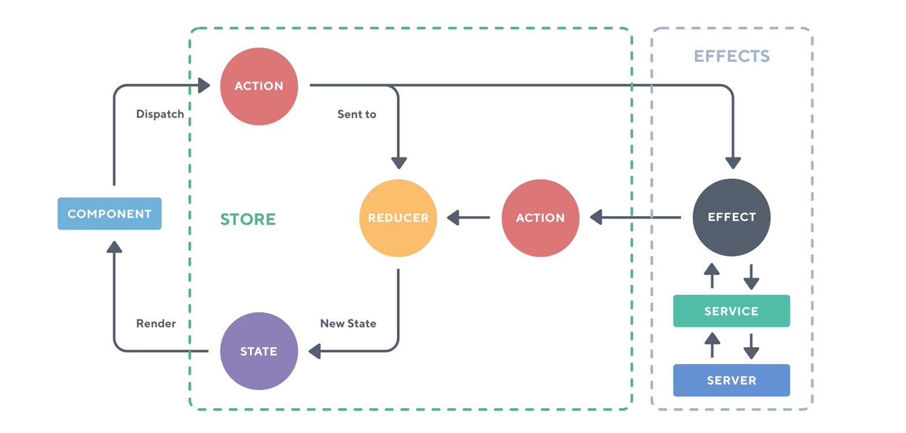

# AngularSkeletonNgrx

## Table of Content

- [Difference with Service Based Angular Skeleton](#difference-with-service-based-angular-skeleton)
- [Getting Started](#getting-started)
- [Navigating through the Angular Skeleton Project](#navigating-through-the-angular-skeleton-project)
- [How to Make this project your own](#how-to-make-this-project-your-own)
- [More about NGRX](#more-about-ngrx)

## Difference with our Service Based Angular Skeleton

- `Examples (Todos and Stock)` and `User Managmenet` under `src/app/components` uses NGRX for handling data and different actions. Checkout these components to see how NGRX integrates with our skeleton App.
- Better handling of passing data around different components. Especially, for non related components.
- Caching of data in store for faster retrieval.
- NGRX really helps to manage data for complex and large applications.
- Maintains one way data flow and reduces error due to updating/mutating data in the components.
- Simplified Component logic.
- More intutive folder structure for each of your custom components.
  - your_custom_component
    - actions - store all the actions needed for this feature component.
    - components - Presentational/dumb components. Just has logic for UI and does not interact with store itself. Only has `@Input()` and `@Output()` properties and local variables.
    - containers - Smart Components. Interact with store and retrieves and send data to/from store. Have presentational components as child components.
    - effects - Listens to actions coming from containers that need to make call to `backend` or `external APIs`. They in turn interact with Angular services.
    - guards - They store local guards required for this components.
    - models - interfaces for types.
    - reducers - These are pure javascript functions that takes in action and current state of the app and returns a new state.
    - selectors - Provide a slice of the state.
    - services - Angular services. They are called from effects.
    - feature routing module - Angular routing module
    - feature module - Angular module for this component.

## Getting Started

- **Backend Setup**:

  - Checkout from the fl_skeleton/trunk in your local machine
  - Complete vhost and other setup to run this project locally (create virtualenv, etc)
  - pip install -r requirements.txt
  - Make sure `STATIC_FOLDER` config refers to `/main/static/dist` under `settings.py`

- **Angular Setup**:
  - NODE, NPM, ANGULAR CLI installation should happen globally.
  - Prerequisites: https://github.com/angular/angular-cli#prerequisites
    - Node 8.0.0 or higher
    - NPM 6 or higher
  - Confirm that you have Prerequisites fulfilled by running below commands:
    - `node -v`
    - `npm -v`
  - Install Angular CLI:
    - https://github.com/angular/angular-cli
    - Documentation: https://github.com/angular/angular-cli/wiki
    - `npm install -g @angular/cli`
    - Check version: `ng -v`
    - For list of commands: `ng help`
  - Install TypeScript:
    - `npm install -g typescript`
  - Once you have completed above 3 steps of Angular setup, go to your project home directory:
    - cd main/static (Make sure it's empty)
    - checkout Angular Skeleton: `svn export --force http://svn.vrtx.com/svn/webdev/angular_skeleton/tags/ngrx-latest .`
    - `npm install` - Reads package.json and install all the libraries (creates a node_modules
      directory, local to this project)
    - You can update different package versions to get the latest build of any library.
  - Compiling and Running the Angular side of the application:
    - For Dev: `ng build --watch`
    - For Production we have two ways:
    - `ng build --prod (Preferred)`
    - `ng build --prod --watch --sourcemap` (For generating actual Typescript files)
    - It creates a 'dist' directory under main/static. Builds your application and watch for any changes to your local files.
  - Angular working dir: `main/static/src/app`

## Navigating through the Angular Skeleton Project

- src – Main working directory
  - app
  - components – All of your custom/feature components.
  - core
    - store - Defines a [NGRX](https://github.com/ngrx?tab=repositories) store for state managment on Angular applications. This directory contains the store module (where the ngrx store is bootstapped and then registerd to the angular applications.). All the common state related actions, reducers, effects (like router, layout, etc.) should be registered here.
    - core components – Navbar, Footer, Infobooth, etc
    - guards – Custom guards for your app
    - services – Core services such as HttpInterceptor, Exception and Toast services, etc.
    - core module – Angular Module
  - shared
    - components - Shared/Reusable Components go here.
    - directives – Custom directives
    - pipes – Very helpful in Angular templates. There are many built in. You can create your custom too and store it here.
    - Material module – All the Material Design components imports
    - Shared Module – Angular Module
  - App-routing-module.ts – The main routing module of your app
  - App.component.html – Bootstrap file for Angular. Kind of landing page.
  - App.module.ts – Main Angular module, all other angular module are registered here.
  - assets – Contain dummy data for this project, images/logo and all the stylesheets.
  - Styles.css – Contain Global styles

## How to Make this project your own

#### When using this skeleton project to build your own app you might consider some of the following steps:

- use `search and replace` functionality of your favourite IDE to replace `app` with <your-app-prefix>. Also update `prefix` variable in `angular.json` file.
- rename project in `package.json` name property and set appropriate version (e.g, 1.0.0)
- rename app under `src/environments/` environments files (will be shown in browser tab). Also under `title tag` in `index.html` file.
- delete pre-existing `CHANGELOG.md` and create your own.
- adjust links in the `footer component`.
- replace logo in `src/assets/img/logo` folder.

## More about NGRX

- NGRX library inluded
  - @ngrx/effects
  - @ngrx/entity
  - @ngrx/router-store
  - @ngrx/store
  - @ngrx/store-devtools
- Read More about NGRX [here](https://github.com/ngrx/platform/tree/master/docs)
- Data flow Image
  

### Angular Documentation: [Link](https://angular.io/guide/architecture)

                                  Happy Coding!!

### For any questions/suggestions/clarification, Please contact us:

- Michael Hawes - [Email](michael_hawes@vrtx.com)
- Sanjiv Kumar - [Email](sanjiv_kumar@vrtx.com)
